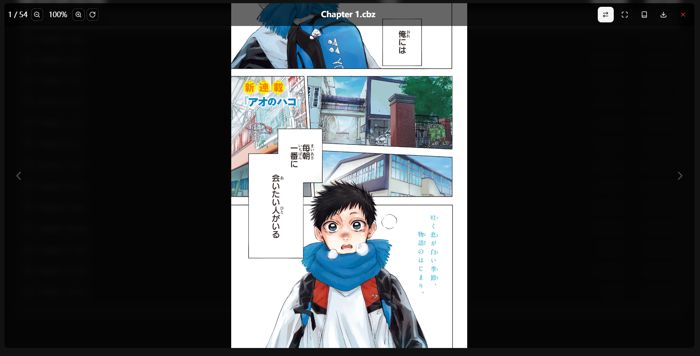
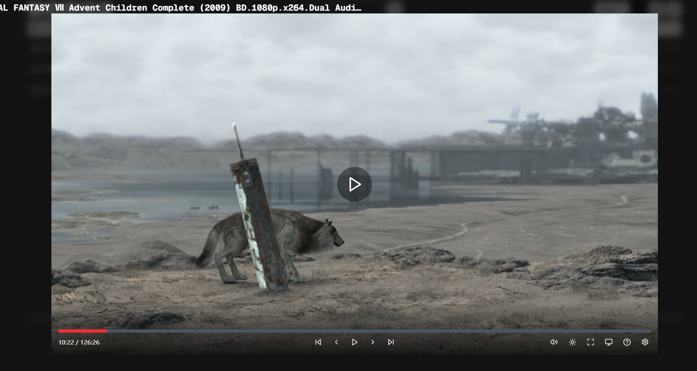
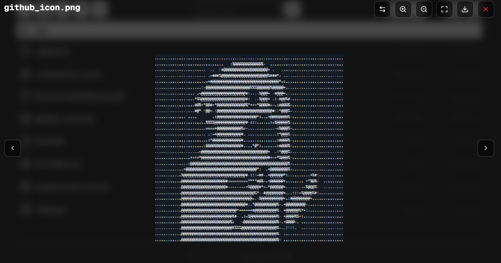
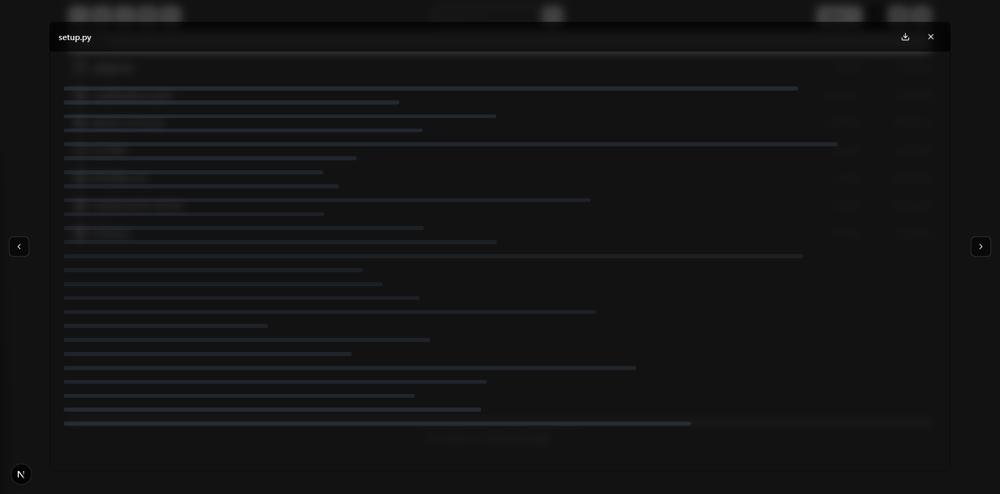
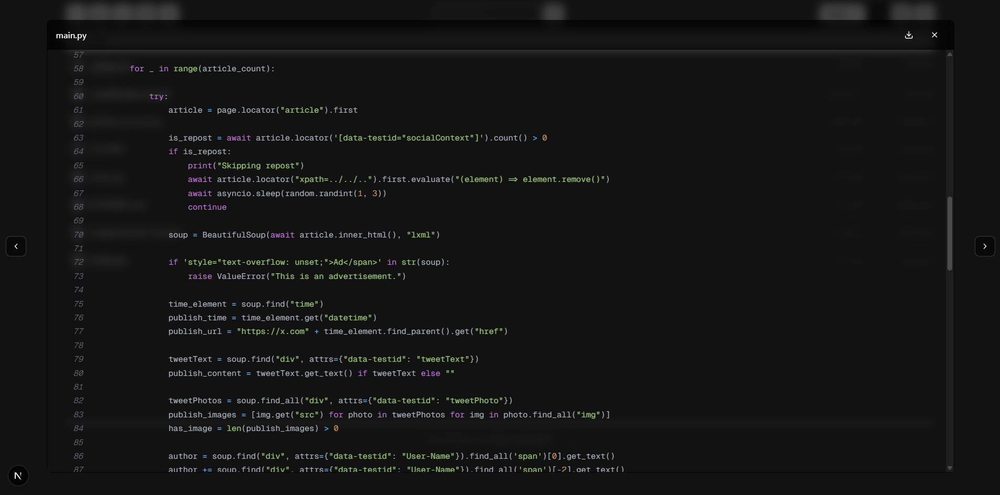

# 功能

## 说在前面

- 什么是导航？（Navigation）

> 我这里提到的导航，大多数情况下是指在同一文件夹下，同类型文件预览的切换。

- 关于支持格式：

> 在项目中，我在判断文件类型时使用了js的[mime-magic](https://github.com/mimemagicrb/mimemagic)库，并且以`image`、`video`、`audio`、`text`、`application`作为分类。预览的功能基于这些类别，但我并不知道浏览器是否能够支持该类别下的所有文件类型。因此在支持格式中，我只会给出我自己进行测试过的文件类型。

## Comic Preview

### 支持格式

- [x] .cbz
- [x] .cbr

### 功能实现 

- [x] 全屏模式

- [x] 双页模式
  - [x] 当屏幕宽度充足时自动切换双页模式（试验）
  - [x] 手动切换单/双页显示

- [x] 阅读方向
  - [x] 支持从右到左与从左到右两种阅读方向

- [x] 触控/鼠标支持
  - [x] 双指缩放（only for touch）
  - [x] 双击重置缩放
  - [x] 放大后可拖动查看放大内容
  - [x] 单击显示/隐藏菜单栏（组件中间区域）
  - [x] 单击翻页/换章（组件左右区域）
  - [x] 左右滑动翻页
  - [x] 滚轮翻页/换章（only for mouse）
  - [x] Ctrl+滚轮缩放（only for mouse）

- [x] 键盘支持
  - [x] 左右方向键翻页（会根据阅读方向自动调整）
  - [x] 空格键翻到下一页
  - [x] Esc键退出全屏或关闭阅读器
  - [x] Enter键切换全屏模式

- [x] 控制栏
  - [x] 显示当前页码/总页数
  - [x] 显示当前缩放比例
  - [x] 支持直接输入页码跳转
  - [x] 支持直接输入缩放百分比
  - [x] 缩放相关按钮
  - [x] 切换阅读方向按钮
  - [x] 切换全屏按钮
  - [x] 切换单/双页按钮
  - [x] 下载按钮
  - [x] 关闭预览按钮 
  - [x] 自动隐藏控制栏（3秒后）

### 示例

### Comic Preview 下禁用的浏览器默认行为

- 缩放（浏览器的双指缩放与Ctrl+滚轮缩放）
- 下拉刷新
- 右键菜单

## Video Preview

### 支持格式

- [x] .mp4
- [x] .mkv
- [ ] .m3u8（特殊格式，待实现）

### 功能实现

- [x] 全屏模式

- [x] 画中画模式

- [x] 鼠标/触控支持
  - [x] 单击进度条跳转
  - [x] 拖拽进度条跳转
  - [x] 左右滑动视频跳转
    - [x] 左右滑动进行跳转时Y轴移动过大时取消跳转
  - [x] 双击视频中区进行播放/暂停
  - [x] 双击视频右/左侧快进/快退
  - [x] 视频左/右区域使用滚轮调节音量/亮度（only for mouse）
  - [x] 视频左/右区域使用上下滑动手势调节音量/亮度（only for touch）

- [x] 键盘支持
  - [x] 空格键播放/暂停
  - [x] 左右方向键快退/快进10秒
  - [x] 上下方向键调节音量
  - [x] Ctrl+上下方向键调节亮度
  - [x] F键切换全屏
  - [x] M键静音/取消静音
  - [x] 逗号/句号键降低/提高播放速度
  - [x] Esc键退出全屏

- [x] 控制栏
  - [x] 视频进度条
    - [x] 进度条拖拽时显示跳转时刻
    - [ ] 进度条拖拽时显示跳转时刻的动画
  - [x] 当前时间/总时长
    - [ ] 输入框支持输入时间跳转
  - [x] 各类控制按钮（现在其响应式排布有点别扭，之后再修） 
    - [x] 播放/暂停按钮
    - [x] 快进/快退按钮
    - [x] 下一个/上一个按钮
    - [x] 音量调节按钮
    - [x] 亮度调节按钮
    - [x] 全屏/退出全屏按钮
    - [x] 画中画/退出画中画按钮
    - [x] 下载按钮
    - [x] 调节播放速度菜单
  - [x] 自动隐藏控制栏（3秒后）
  - [x] 鼠标悬停控制栏不自动隐藏

- [x] 其它
  - [x] 音量和亮度指示器
  - [x] 取消滑动跳转时的提示
  - [x] 快进/后退时连续操作的累计时间显示
  - [x] 键盘快捷键帮助显示

- [ ] 视频内打包多声轨支持
- [ ] 视频内打包多字幕支持
- [ ] 外挂字幕支持
- [ ] 外挂音轨支持

### 示例

### Video Preview 下禁用的浏览器默认行为

- 右键菜单

### BUG

- [ ] 有时候视频播放无声，未找到具体BUG源，猜测是音轨问题。

## Image Preview

### 支持格式

- [x] .jpg, .jpeg, .png, .gif, .bmp, .webp, .svg, .tiff, .ico, .raw, .psd

### 功能实现

- [x] 全屏模式

- [ ] 双页模式

- [x] 导航方向
  - [x] 支持从左到右与从右到左两种导航方向

- [x] 鼠标/触控支持
  - [x] 双指缩放（only for touch）
  - [x] 双击重置缩放
  - [x] 放大后可拖动查看放大内容
  - [x] 左右滑动翻页
  - [x] 滚轮导航（only for mouse）
  - [x] Ctrl+滚轮缩放（only for mouse）

- [x] 键盘支持
  - [x] 左右方向键翻页（会根据导航方向自动调整）
  - [x] 空格键翻到下一页
  - [x] Esc键退出全屏
  - [x] Enter键切换全屏

- [x] 控制部分
  - [x] 缩放相关按钮
  - [x] 导航相关按钮
  - [x] 切换导航方向按钮
  - [x] 切换全屏按钮
  - [x] 下载按钮
  - [x] 关闭预览按钮

- [x] 补充：图片缩放
  - [x] 支持自定义初始缩放级别（代码层级设置）
  - [x] 可配置最大/最小缩放级别（代码层级设置）
  - [x] 支持缩放步长设置（代码层级设置）

- [x] 补充：拖动与定位
  - [x] 惯性滑动效果，拖动后自然减速（试验）
  - [x] 边界限制，防止图片拖出视图
  - [x] 边界可配置（代码层级设置）
  - [x] 缩放变化时自动调整位置到合理范围（考虑移除或更换实现）

### 示例

### Image Preview 下禁用的浏览器默认行为

- 浏览器默认的拖动行为
- 下拉刷新
- 默认的触摸延迟

## Text Preview

### 支持格式

- [x] text类型文件

### 功能实现

- [ ] ~~全屏模式~~（直接用响应式了）

- [x] 代码高亮（基于[react-syntax-highlighter](https://github.com/react-syntax-highlighter/react-syntax-highlighter)）

- [x] 控制部分：
  - [x] 下载按钮
  - [x] 关闭预览按钮

### 示例

### Text Preview 下禁用的浏览器默认行为

无

## EPUB Preview

### 支持格式

- [x] .epub

### 功能实现

### 示例