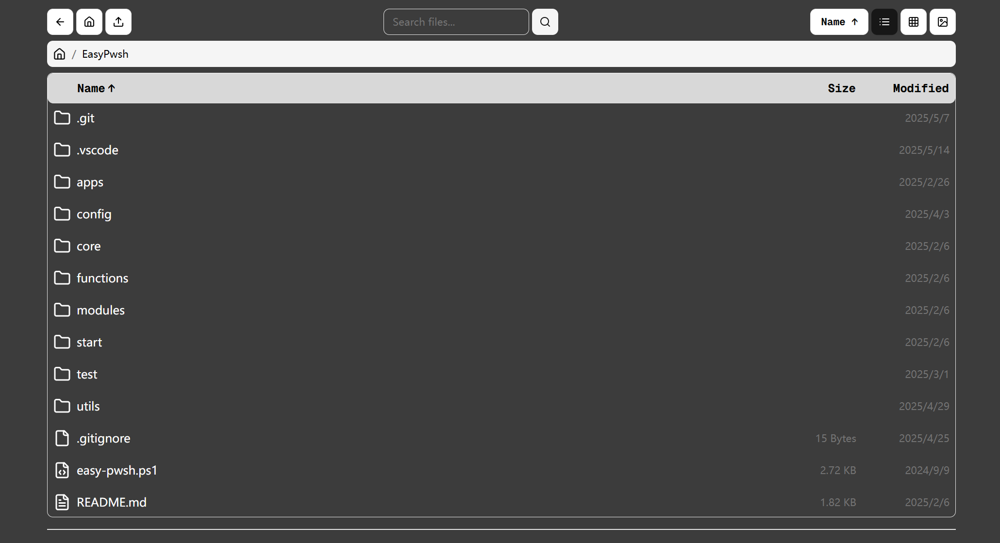
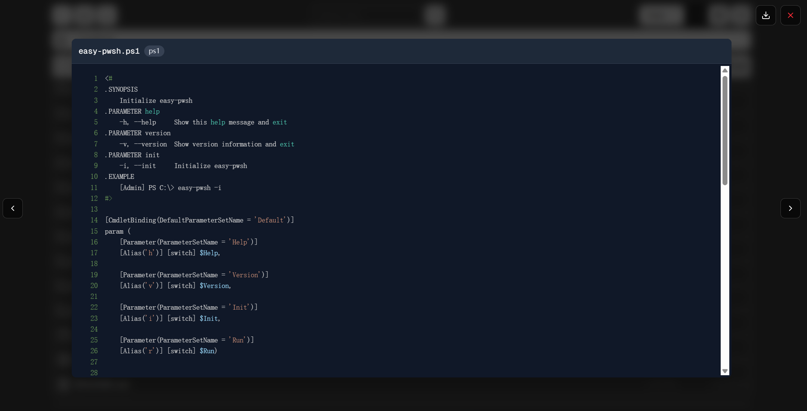
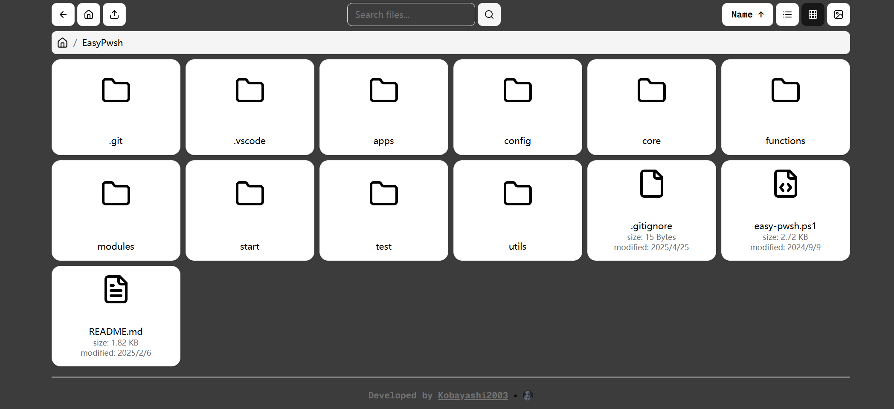
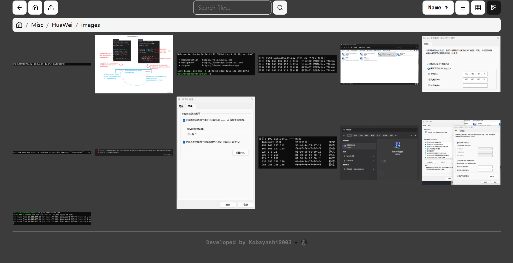

# SimpleFileServer

SimpleFileServers是一款基于HTTP协议的，支持文件共享、预览、互传（上传下载）功能的在线网页版文件服务器，无需下载通过浏览器即可快速访问。
## 特点：

- 充当一座桥连接不同客户端，为各种终端（linux/windows/android/mac/ios)用户提供文件互传和预览功能
- 查阅linux平台上文件的一站式解决方案，界面简洁，简单易用
- 提供类似于网盘的存储文件功能
- 开箱即用，无需下载专用客户端，通过浏览器即可一键便捷式预览，拖拽式秒传文件
- 预览功能兼容多种常见的文件格式（comic/video/pdf/image/audio/text/epub/psd）
- 一键式部署，跨平台运行，支持主流平台：Windows，Linux和Mac

## 功能
🔍 文件查找（利用索引加快文件搜索）

📩 文件上传下载（一键式拖拽上传）

📂文件基本操作：复制移动重命名创建删除

​​ 支持comic/video/pdf/image/audio/text/epub/psd多格式文件悬浮预览

📌文件导航栏记录路径

✅支持列表/网格/仅图片等多文件展示形式
## 典型使用场景

- **与同事，家人共享文件夹**

- **收集学生上传的作业**

- **用作云备份网盘**

- **无需下载实现远程预览文件**

## 一些示例









## 如何运行

### Prerequisites
- Node.js 18+ and npm

### Installation Steps

1. Clone the repository
```bash
git clone https://github.com/Kobayashi2003/SimpleFileServer.git
cd SimpleFileServer
```

2. Install dependencies
```bash
# Install backend dependencies
cd backend
npm install

# Install frontend dependencies
cd ../frontend
npm install
```

3. Configuration
Set the base directory in `backend/config.js`:
```js
module.exports = {
  baseDirectory: process.env.BASE_DIRECTORY || 'your/path/here',
}
```

4. Run the servers
```bash
# Run the backend server (development mode) (Default port: 11073)
cd backend
npm run dev

# Or run the backend server (production mode) (Default port: 11073)
cd backend
npm start

# In another terminal, run the frontend server (Default port: 2711)
cd frontend
npm run dev

# Or run the frontend server (production mode) (Default port: 2711)
cd frontend
npm run build
npm start
```

5. Access the application
Open your browser and navigate to `http://localhost:${YOUR_PORT_HERE}`

## 如何测试各种格式的预览功能
在tests文件夹目录下存放各种格式的example  
## Comic Preview

### 支持格式

-   .cbz
-   .cbr

### 功能实现 

-   全屏模式

-   双页模式
  -   当屏幕宽度充足时自动切换双页模式（试验）
  -   手动切换单/双页显示

-   阅读方向
  -   支持从右到左与从左到右两种阅读方向

-   触控/鼠标支持
  -   双指缩放（only for touch）
  -   双击重置缩放
  -   放大后可拖动查看放大内容
  -   单击显示/隐藏菜单栏（组件中间区域）
  -   单击翻页/换章（组件左右区域）
  -   左右滑动翻页
  -   滚轮翻页/换章（only for mouse）
  -   Ctrl+滚轮缩放（only for mouse）

-   键盘支持
  -   左右方向键翻页（会根据阅读方向自动调整）
  -   空格键翻到下一页
  -   Esc键退出全屏或关闭阅读器
  -   Enter键切换全屏模式

-   控制栏
  -   显示当前页码/总页数
  -   显示当前缩放比例
  -   支持直接输入页码跳转
  -   支持直接输入缩放百分比
  -   缩放相关按钮
  -   切换阅读方向按钮
  -   切换全屏按钮
  -   切换单/双页按钮
  -   下载按钮
  -   关闭预览按钮 
  -   自动隐藏控制栏（3秒后）

### 示例


### Comic Preview 下禁用的浏览器默认行为

- 缩放（浏览器的双指缩放与Ctrl+滚轮缩放）
- 下拉刷新
- 右键菜单

## Video Preview

### 支持格式

-   .mp4
-   .mkv
-   .m3u8（特殊格式，待实现）

### 功能实现

-   全屏模式

-   画中画模式

-   鼠标/触控支持
  -   单击进度条跳转
  -   拖拽进度条跳转
  -   左右滑动视频跳转
    -   左右滑动进行跳转时Y轴移动过大时取消跳转
  -   双击视频中区进行播放/暂停
  -   双击视频右/左侧快进/快退
  -   视频左/右区域使用滚轮调节音量/亮度（only for mouse）
  -   视频左/右区域使用上下滑动手势调节音量/亮度（only for touch）

-   键盘支持
  -   空格键播放/暂停
  -   左右方向键快退/快进10秒
  -   上下方向键调节音量
  -   Ctrl+上下方向键调节亮度
  -   F键切换全屏
  -   M键静音/取消静音
  -   逗号/句号键降低/提高播放速度
  -   Esc键退出全屏

-   控制栏
  -   视频进度条
    -   进度条拖拽时显示跳转时刻
    -   进度条拖拽时显示跳转时刻的动画
  -   当前时间/总时长
    -   输入框支持输入时间跳转
  -   各类控制按钮（现在其响应式排布有点别扭，之后再修） 
    -   播放/暂停按钮
    -   快进/快退按钮
    -   下一个/上一个按钮
    -   音量调节按钮
    -   亮度调节按钮
    -   全屏/退出全屏按钮
    -   画中画/退出画中画按钮
    -   下载按钮
    -   调节播放速度菜单
  -   自动隐藏控制栏（3秒后）
  -   鼠标悬停控制栏不自动隐藏

-   其它
  -   音量和亮度指示器
  -   取消滑动跳转时的提示
  -   快进/后退时连续操作的累计时间显示
  -   键盘快捷键帮助显示

-   视频内打包多声轨支持
-   视频内打包多字幕支持
-   外挂字幕支持
-   外挂音轨支持

### 示例


## Image Preview

### 支持格式

-   .jpg, .jpeg, .png, .gif, .bmp, .webp, .svg, .tiff, .ico, .raw
-   .psd

### 功能实现

-   全屏模式

-   双页模式

-   导航方向
  -   支持从左到右与从右到左两种导航方向

-   鼠标/触控支持
  -   双指缩放（only for touch）
  -   双击重置缩放
  -   放大后可拖动查看放大内容
  -   左右滑动翻页
  -   滚轮导航（only for mouse）
  -   Ctrl+滚轮缩放（only for mouse）

-   键盘支持
  -   左右方向键翻页（会根据导航方向自动调整）
  -   空格键翻到下一页
  -   Esc键退出全屏
  -   Enter键切换全屏

-   控制部分
  -   缩放相关按钮
  -   导航相关按钮
  -   切换导航方向按钮
  -   切换全屏按钮
  -   下载按钮
  -   关闭预览按钮

-   补充：图片缩放
  -   支持自定义初始缩放级别（代码层级设置）
  -   可配置最大/最小缩放级别（代码层级设置）
  -   支持缩放步长设置（代码层级设置）

-   补充：拖动与定位
  -   惯性滑动效果，拖动后自然减速（试验）
  -   边界限制，防止图片拖出视图
  -   边界可配置（代码层级设置）
  -   缩放变化时自动调整位置到合理范围（考虑移除或更换实现）

### 示例


### Image Preview 下禁用的浏览器默认行为

- 浏览器默认的拖动行为
- 下拉刷新
- 默认的触摸延迟


## Text Preview

### 支持格式

-   text类型文件

### 功能实现

-   ~~全屏模式~~（直接用响应式了）

-   代码高亮（基于[react-syntax-highlighter](https://github.com/react-syntax-highlighter/react-syntax-highlighter)）

-   控制部分：
  -   下载按钮
  -   关闭预览按钮

### 示例


### Text Preview 下禁用的浏览器默认行为

无

## EPUB Preview

### 支持格式

-   .epub

### 功能实现

### 示例

## PDF Preview

### 支持格式

-   .pdf

### 示例


## Audio Preview

### 支持格式

-   .mp3
-   .aac
-   .wav
-   .flac

### 功能实现

### 示例


## 四种ViewMode+masonry布局

### List View

### Grid View

### Image View

### Image Only View

### Masonry View（在Image Only View的基础上开启）


## 基本功能介绍

-   文件右键菜单
-   文件搜索
-   文件预览
-   文件详情
-   文件排序 

-   文件下载
-   批量文件下载 

-   文件上传
-   批量文件上传
-   文件夹上传

-   文件删除
-   批量文件删除 

-   文件剪切（移动）
-   批量文件剪切（移动）

-   文件复制粘贴（克隆）
-   批量文件复制粘贴（克隆）

-   文件重命名
-   文件夹创建
-   文件夹删除
-   当前结果过滤


## 其他

-   面包屑导航
-   Index控制面板
-   Watcher控制面板
-   登录
-   刷新按钮 
-   文件夹封面（测试，当前版本会造成较大的性能损失）

## 后端

### 使用文件索引

通过添加环境变量`USE_FILE_INDEX`为`true`，可以启用文件索引。

当使用文件索引时，后端在启动时将会自动构建基于`BASE_DIR`的文件索引，构建完成后，后端将会基于文件索引进行文件的搜索。

### 使用文件监视

通过添加环境变量`USE_FILE_WATCHER`为`true`，可以启用文件监视。

该功能需要`USE_FILE_INDEX`为`true`，其作用为在`BASE_DIR`目录下的文件发生变化时，自动更新文件索引（若不开启，当文件发生变化时，需要手动重新构建文件索引）。

### 用户认证

通过添加环境变量`USER_RULES`，可以设置用户认证规则。

格式为：`username|password|rw`，其中`username`为认证用户名，`password`为认证密码，`rw`为认证权限，`r`为只读，`w`为读写。

### 生成缩略图

通过添加环境变量`GENERATE_THUMBNAIL`为`true`，可以启用缩略图生成。
## License

[MIT](LICENSE)

## Author

[林隽哲](https://github.com/Kobayashi2003)
[江颢怡](https://github.com/yki0205)
[刘晓丹](https://github.com/lxdsuperbeauty)
[刘彦凤](https://github.com/Fola273)
[赖汶慈](https://github.com/Wenci6107)
